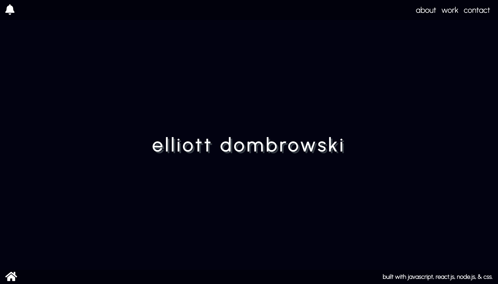
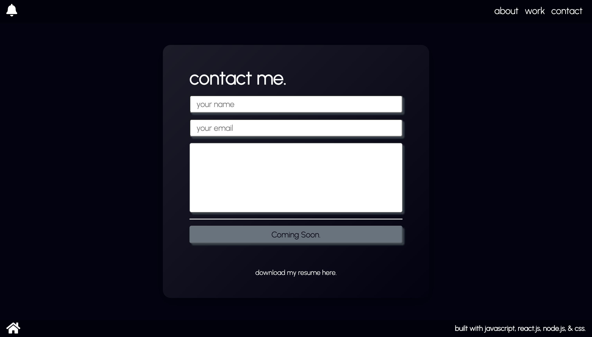

# REACT PORTFOLIO 

###  This is my personal portfolio page.   It is built with ReactJS, JavaScript, ExpressJS, NodeJS, jQuery, and CSS.   ExpressJS / NodeJS backend functionality is used to allow for live Heroku deployment, as well as a future implementation of the Nodemailer npm package.   jQuery is used to handle animations between page renders.   All icons from FontAwesome.   Fonts from GoogleFonts.

---

## DEPLOYED SITE / GITHUB
### live heroku deployment - https://react-portfolio-site.herokuapp.com/
### github repo - https://github.com/elliottdombrowski/portfolio-mern

---

---

---

---

## CONTACT ME

### github - https://github.com/elliottdombrowski
### linkedin - https://www.linkedin.com/in/elliott-dombrowski-8b2ba8211/